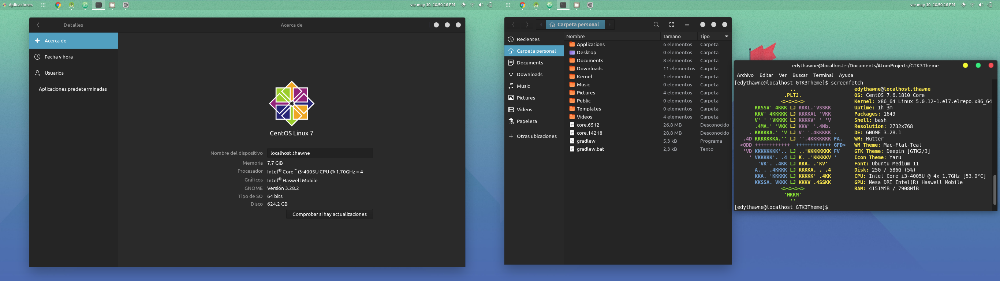
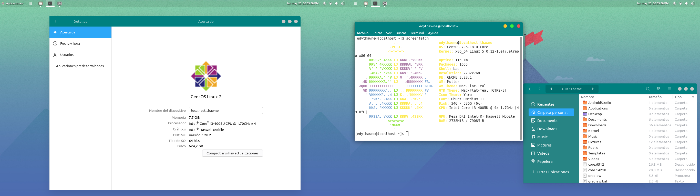

# GTK3 Theme for Centos 7

Selección de Temas GTK3 para CentOs 7 con versión de Gnome 3.28

## Tabla de Contenido
- [Deepin Theme](DeepinTheme)
- [MAC Teal Theme](MacFlatTealTheme)

## Capturas de Pantalla

- Deepin Theme

- Mac Flat Teal Theme

## ¿Como usar los GTK Theme?

- Clonar o Descargar el [Repositorio](https://github.com/edythawne/gtk3_my_themes.git)
- Descomprimir el archivo descargado "gtk3_my_themes"
- Crear una carpeta llamada ".themes" en la raiz de su partición "/home"
- Copiar el cualquier tema de su preferencia de la carpeta "gtk3_my_themes" a ".themes"
